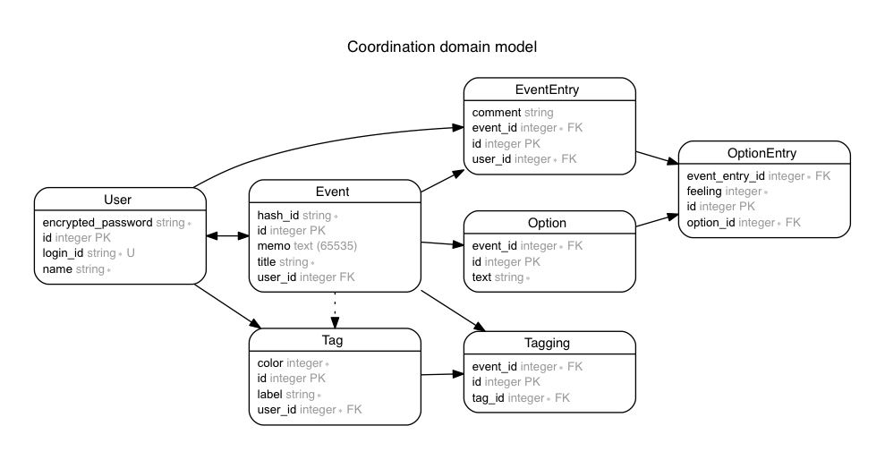
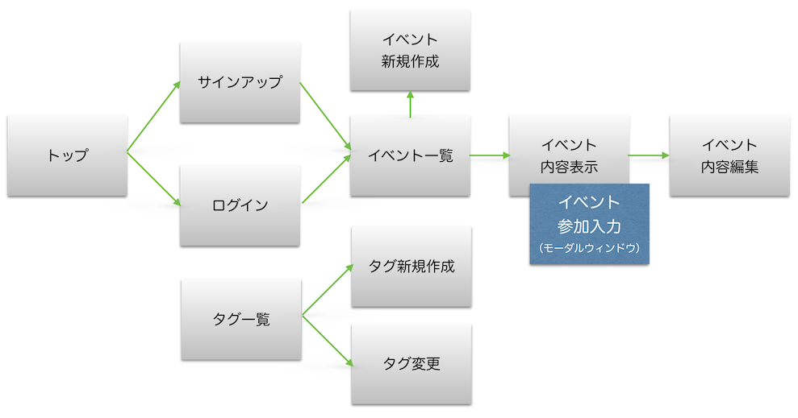

# 参確さん

## 概要

イベントの参加予定を確認（参確）するためのWebアプリ。

- [本家サンプル](https://chouseisan.com/s?h=028c5bfdf74c4912a6b2a697c4fed4a3)
- [オリジナル（「俺の…」）のアプリ (Heroku)](https://dry-basin-5475.herokuapp.com/events/e770a86069561b98d0078d5df057d9ae)

## 機能
- *予定を調整してイベントの日程を決定するプロセスよりも、日程が確定した後の参加確認・参加準備に重きをおく。*

- 本家とは異なり、ユーザー管理する。
- ハッシュURLを知っている人はだれでもイベントにアクセスし、イベント情報を閲覧できる。【予定】本家同様、だれでも参確を入力できる。
    - 【削除予定】~~出欠表の一覧は、各候補日での回答者の出欠状況に応じ、以下の判定どおりに行の背景色が変化する。~~
        - ~~全員が×だと背景色がつかない。~~
        - ~~全員が○だと濃いグリーンで表示される。~~
        - ~~それ以外は薄いグリーン。~~
    - 【予定】イベントの出欠状況の表示順は、本家および「俺の…」のような最初に出欠を入力した順ではなく、更新日時順に変更する。（先着や定員は実装せず運用でカバーする。しかし△または✕をあらかじめ入力しておいて後から○に変更するという、先着順のチート行為を防ぐため）
    - さらにログインすれば以下のことが可能。
        - 【ログイン不要に修正予定】自分の出欠を記入できる。
        - 出欠入力は候補に対してそれぞれ○、△、×で設定する。
        - 出欠とともにコメントを設定できる。
        - １度記入した出欠入力の更新入力が可能。
        - 【済】ユーザー登録時点で、メールアドレスを登録する。
        - 【予定】ユーザーが作成されると、対応するハッシュURLが生成される
        - 【予定】以下の iCal を発行し、自分のカレンダーソフトにインポートできる
            - 個々のイベント
            - 特定のユーザーが主催するイベント一覧
            - ユーザー自身が参加する（○をつけた）イベント一覧
        - 【予定】ユーザーハッシュURLは、ユーザーの操作で更新できる（ユーザーハッシュがバレると、参加状況を他の人が確認できてしまうため）
        - 【予定】ユーザーは自己紹介を登録できる。
- アカウントを持つユーザーは、イベントを作ることができる。
    - イベントの名前をつける。（必須）
    - 【予定】イベントの開始日時・終了日時を設定する。（必須）
    - イベントのメモを設定できる。
    - イベントの場所を設定できる。
    - 【予定】イベント作成時に自動的に「出欠」のアンケート項目が作成される
    - ~~候補日程~~「アンケート」（【予定】仮称）を設定できる
    - ~~候補日程~~「アンケート」（【予定】仮称）は改行で複数設定できる。
    - イベントを作成すると、アクセス用URLが生成される。
    - イベントの変更（再編集・削除）はイベント作成者のみ可能。
    - 【予定】主催者はイベント参加者に対して、メールで連絡を送ることができる。（イベント開催後、削除されるまで）
    - 【予定】主催者は「通知」機能を使って、参加者にメッセージを送信することができる。（イベント開催後、削除されるまで）
- 【予定】ユーザーハッシュURLから、だれでも特定のユーザー主催のイベント一覧を表示できる。表示内容は以下のように変更する。
    - ヘッダー部分。ユーザーの名前、自己紹介。
    - 詳細部分の項目。イベントの名前、開始日時・終了日時、場所、イベントアクセス用URL。
- 【予定】イベント作成補助として、以下の機能を提供する
    - ユーザーごとに「場所」を複数（10カ所まで）登録できる。同じ場所であってもユーザー間で共有しない。
        - 場所には名前を登録する。（必須）
        - 場所には位置情報を登録できる。
        - 位置情報の登録の際には、Google の補助を利用する。
        - 場所には、対応する「イベントのメモのテンプレート」が登録できる。
        - 場所を選ぶと自動的に「イベントのメモ」に入力される。
- 【予定】終了日時から3カ月経過したイベントは自動的に削除される。

#### 本家には機能として存在するが、実装しないもの

- ~~1ヶ月誰も更新しなかったイベントは、自動的に削除される。~~
- ガラケー表示対応。
- 出欠表のダウンロード。

## ERD

## 画面遷移

